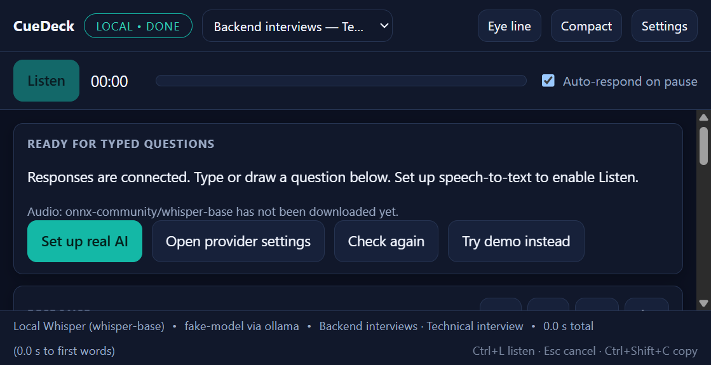
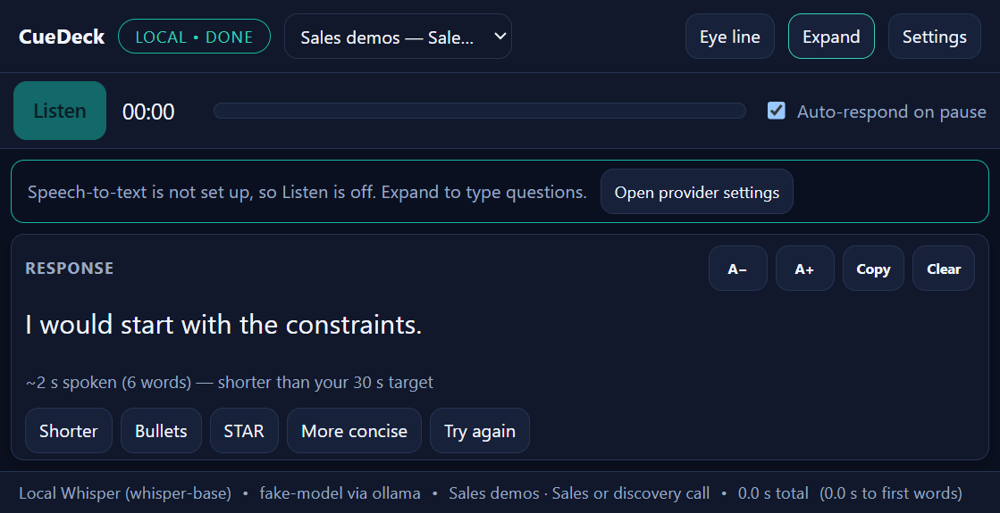
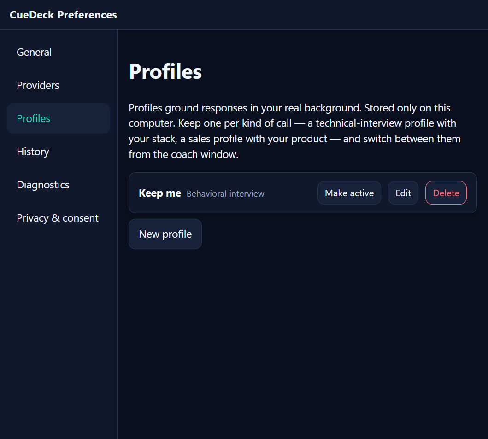

# CueDeck setup, deployment, and user guide

Version 0.1.0 · Windows 10/11 x64 · written 2026-09-18

CueDeck is a desktop coach for calls and interviews. It listens to a short clip of what the other
person says, transcribes it, and streams a first-person answer you could say next, grounded in a
profile you wrote. It is built for mock interviews, rehearsal, accessibility support, and calls
where recording and AI assistance are disclosed and permitted. It always shows a recording
indicator, never records on its own, and has no way to hide itself from screen sharing.

Sections:

1. [Setup for users](#1-setup-for-users)
2. [Using CueDeck on a call](#2-using-cuedeck-on-a-call)
3. [Profiles and call types](#3-profiles-and-call-types)
4. [Practice mode](#4-practice-mode)
5. [Settings reference](#5-settings-reference)
6. [Troubleshooting](#6-troubleshooting)
7. [Setup for developers](#7-setup-for-developers)
8. [Building and deploying](#8-building-and-deploying)
9. [Privacy and data locations](#9-privacy-and-data-locations)

---

## 1. Setup for users

### What you need

| Requirement            | Notes                                                                                                                                                           |
| ---------------------- | --------------------------------------------------------------------------------------------------------------------------------------------------------------- |
| Windows 10 or 11 x64   | CueDeck captures the computer's own audio output (what you hear), which is Windows-only in this version.                                                        |
| One of three AI setups | **Cloud free tier** (Groq recommended: one free key does both speech and answers), **Demo** (no AI, fixed sample), or **Local** (Whisper + Ollama, no account). |
| Node.js 22 LTS         | Only if you run from source (`Start CueDeck.cmd`). Not needed for the installer.                                                                                |
| Disk                   | ~250 MB installed. Local mode adds 120–600 MB for the speech model plus the Ollama model you choose.                                                            |

### Install from the installer

1. Run `CueDeck-Setup.exe`. It installs per-user (no administrator prompt) and puts a shortcut in
   the Start menu. Because the installer is not code-signed, Windows SmartScreen shows "Windows
   protected your PC": choose **More info → Run anyway**. Compare the file's SHA-256 with the
   published `SHASUMS256.txt` first if you want to be sure it is the release you expect.
2. CueDeck opens at the top-centre of your screen with the first-run flow.

### Run from source instead

1. Install Node.js 22 LTS.
2. Unzip or clone the repository and double-click **Start CueDeck.cmd** in the top folder. The
   first start runs `npm ci` (a few minutes) and then launches the app; later starts are direct.

### First-run flow (5 steps, about two minutes)

1. **Consent.** Read the recording notice and tick the acknowledgement. You are responsible for
   participant consent and the rules that apply to your calls.
2. **Choose how answers are generated.**
   - **Use cloud free tier** (fastest to real AI): pick Groq, click **Get Groq API key**, create a
     free key in your Groq account, paste it, click **Save and test**. One key covers both
     transcription and answers. Gemini also does both; OpenRouter and Cerebras do answers only
     (typed questions work immediately, Listen needs the local speech model too).
   - **Try the demo**: no key, no download; streams a fixed sample so you can learn the controls.
   - **Use local mode**: download a Whisper model (Base is recommended) and install Ollama with a
     small model (`ollama pull qwen2.5:3b-instruct`). Nothing leaves your computer.
3. **Test system audio.** Play any sound on the computer and run the 5-second test. If it reports
   silence, see [Troubleshooting](#6-troubleshooting).
4. **Add your background (optional but recommended).** Name, call type, tech stack, résumé
   summary, and role context. This is what answers are grounded in; the model is instructed never
   to invent experience you did not list.
5. Click **Finish setup**. You land on the coach window.

## 2. Using CueDeck on a call

### Put the answer where your eyes are

The coach window opens top-centre of the screen, right under a laptop or monitor webcam, so
reading an answer keeps your gaze near the camera. If you move it, it remembers the new spot.

- **Eye line** (title bar) moves the window back to top-centre of whichever screen it is on and
  keeps it above the meeting window ("Keep on top" is switched on for you).
- **Compact** switches to the eye-line layout: only the capture controls and the response, in
  larger text. **Expand** brings back the transcript, practice deck, notes, and style controls.
- **A−** / **A+** on the response card change the text size. Preferences → General has a slider.

Full layout (here with speech-to-text not yet set up, so the readiness card explains what is
missing above the response):



Compact (eye-line) layout: controls, a one-line notice if Listen is unavailable, and the response:



### The loop

1. Press **Listen** (or `Ctrl+L`). The red **Recording** badge appears; the meter shows the level.
2. When the other person pauses for about 1.6 seconds, CueDeck stops by itself ("Auto-respond on
   pause", on by default) and submits the clip. Or press **Stop & respond** yourself.
3. The transcript appears in **Heard**; the answer streams into **Response** at the top.
4. Read it, or **Copy** (`Ctrl+Shift+C`). Follow-ups regenerate without re-recording: **Shorter**
   (15 s target), **Bullets**, **STAR**, **More concise**, **Try again**.
5. **Esc** or **Cancel** stops anything in flight. **Clear** resets the card.

Under the response, the pace line ("~28 s spoken, 70 words, about right for your 30 s target")
tells you whether the draft fits the speaking time you chose.

### Session notes

The **Session notes** box (full layout) is for this call only: company, role, points to hit. It is
sent with every request and never stored. **Clear** empties it.

### Keyboard shortcuts

| Keys           | Action                                    |
| -------------- | ----------------------------------------- |
| `Ctrl+L`       | Listen, or Stop & respond while recording |
| `Esc`          | Cancel the current recording or answer    |
| `Ctrl+Shift+C` | Copy the response                         |

## 3. Profiles and call types

A profile is the background the model may draw on. Since this release each profile also has a
**call type** and an optional **tech stack**:

| Call type               | What it changes in the answer                                                                                                           | Suggested style |
| ----------------------- | --------------------------------------------------------------------------------------------------------------------------------------- | --------------- |
| General                 | Nothing extra; balanced spoken answers.                                                                                                 | Natural, 30 s   |
| Technical interview     | Names real tools and trade-offs, explains reasoning, outlines design/coding tasks as steps, never claims experience outside your stack. | Natural, 30 s   |
| Behavioral interview    | One specific situation, what you did, the result; no invented metrics.                                                                  | STAR, 60 s      |
| Sales or discovery call | You are the seller: customer problem first, one discovery question, benefit-led claims.                                                 | Concise, 15 s   |
| Customer support        | You are the agent: acknowledge, then next steps; never promise what the data does not support.                                          | Concise, 15 s   |
| Team meeting            | Colleague voice: position, reason, next step.                                                                                           | Concise, 15 s   |

The call type adds fixed answering rules to the prompt. The tech stack is sent as reference data
in its own fenced block, so it grounds what the model may claim without being able to change its
instructions.

**Recommended setup:** one profile per kind of call you take, e.g. "Backend interviews"
(technical interview; Go, Postgres, Kafka), "Frontend interviews" (technical interview;
TypeScript, React), "Sales demos" (sales or discovery call; your product). Paste the same résumé
summary into each; only the call type and stack differ.

**Switching:** use the profile picker in the coach title bar. It shows "name — call type", and
the status rail confirms which profile is active. Profiles are created and edited in
Preferences → Profiles (when you have none yet, the picker shows an **Add profile** button):



The default-style card suggests the call type's style with a one-click link; your saved default
is never changed for you.

## 4. Practice mode

In the full layout, **Practice** deals questions from a built-in bank (background, behavioral,
technical, motivation, teamwork, curveballs). Pick a category, or let the active profile choose
it (a technical-interview profile defaults to Technical). **Draw a question** puts it in
**Heard**; answer aloud first, then **Respond to edited text** to compare with a suggested
answer. The deck deals every question once before reshuffling and never repeats one back to back.
Practice works fully offline in local mode and needs no audio.

## 5. Settings reference

Open with **Settings** in the title bar. The window stays open in the background once opened, so
the second open is instant.

| Section           | What is there                                                                                                                                                                                                |
| ----------------- | ------------------------------------------------------------------------------------------------------------------------------------------------------------------------------------------------------------ |
| General           | **Dock at eye level now**, keep on top, compact (eye-line) layout, text size, maximum clip length (30–120 s), target speaking time (15/30/60 s), transcription language.                                     |
| Providers         | Guided free cloud setup; speech-to-text and response provider pickers; local model download; Ollama address (localhost only); one encrypted key slot per cloud account; **Switch everything to local-only**. |
| Profiles          | Create, edit, activate, and delete profiles (delete asks for confirmation). Shows a character/token estimate for the context you are sending.                                                                |
| History           | Off by default. When on, saves transcript + answer (never audio) with a retention window; search, export JSON/Markdown, delete one or all (confirmed).                                                       |
| Diagnostics       | Versions, provider ids, local model state, last 20 redacted errors; copy a report with optional transcripts/profile text.                                                                                    |
| Privacy & consent | The recording, permitted-use, and data-location statements, plus version numbers.                                                                                                                            |

Errors on the coach have an **Open settings** button that opens the section that fixes them
(providers for key/model problems, diagnostics for capture and unknown errors).

## 6. Troubleshooting

| Symptom                                             | What to do                                                                                                                                                                                                                 |
| --------------------------------------------------- | -------------------------------------------------------------------------------------------------------------------------------------------------------------------------------------------------------------------------- |
| Status chip says **Setup needed**; Listen is greyed | The readiness banner says which side is missing. "Ready for typed questions" means answers work but speech does not: open Preferences → Providers and either save a Groq/Gemini key or download a local Whisper model.     |
| "No audio detected yet" while recording             | CueDeck records what the computer plays, not the microphone. Make sure the call audio goes to the default output device and is not muted. Bluetooth headsets sometimes expose a second device; pick the one the call uses. |
| "The recording was silent"                          | Same cause as above, detected after Stop. Run the audio test in Preferences via **Set up real AI** → audio step.                                                                                                           |
| "The provider rejected the saved API key"           | Preferences → Providers → replace the key. Keys never display after saving.                                                                                                                                                |
| "The provider rate-limited this request"            | Free tiers have per-minute and per-day quotas. Wait, or switch provider. Nothing is saved when a request fails.                                                                                                            |
| "Is Ollama running?"                                | Start Ollama, then **Check again**. CueDeck only talks to `http://127.0.0.1:11434`.                                                                                                                                        |
| Window is off-screen after unplugging a monitor     | It should come back top-centre on its own. If not, click **Eye line** from Preferences → General → **Dock at eye level now**, or delete `window-state.json` (see section 9).                                               |
| SmartScreen blocks the installer                    | Expected for an unsigned build; use **More info → Run anyway** after checking the SHA-256.                                                                                                                                 |
| Answers reference tools you never used              | Check the active profile's tech stack and summary; the model is told to stay inside them, and the technical call type makes that rule explicit. Switch profile in the title bar if the wrong one is active.                |
| Everything is slow on first use in local mode       | The first answer loads the models into memory. CueDeck pre-loads them at start-up and when you press Listen; give it a few seconds after launch before the first clip.                                                     |

To reset the app completely, close it and delete `%APPDATA%\CueDeck`.

## 7. Setup for developers

```powershell
cd cuedeck
npm ci          # exact lockfile versions; needs Node 22 LTS
npm start       # Electron Forge dev app with Vite hot reload
```

Checks, in the order the CI-style `npm run check` runs them:

```powershell
npm run format:check
npm run lint
npm run typecheck
npm test                 # unit (Vitest, node environment)
npm run test:integration # real adapters against loopback fake servers
npm run test:e2e         # builds, then Playwright drives the real Electron app
```

Notes for this machine class: the unit tier takes about three minutes, `tsc` two to four, and the
Electron E2E tier launches the app 30+ times. Run them one at a time; two in parallel on a
16 GB machine with browsers open has been enough to make Electron fail to launch
(exit code `0xC0000142`).

Source map: `src/main` (privileged process: windows, IPC, providers, stores), `src/preload`
(the fixed `window.cuedeck` API), `src/renderer` (React: `routes/`, `coach/`, `preferences/`,
`state/`), `src/shared` (types, Zod schemas, prompt assembly, call types, practice deck).
Architecture and development guides live in `cuedeck/docs/`.

## 8. Building and deploying

CueDeck ships as an unsigned Windows installer plus a zip, both with SHA-256 checksums.

```powershell
cd cuedeck
npm ci
npm run check            # gate: format, lint, types, unit, integration
npm run test:e2e         # gate: Electron end-to-end
npm run make             # Electron Forge: package + Squirrel installer + zip
node scripts/checksums.mjs
```

Outputs:

| Artifact                                                              | Purpose                                                          | Size (0.1.0 build of 2026-09-18) |
| --------------------------------------------------------------------- | ---------------------------------------------------------------- | -------------------------------- |
| `out/make/squirrel.windows/x64/CueDeck-Setup.exe`                     | Per-user installer (Squirrel); creates Start-menu shortcut       | 140 MB                           |
| `out/make/squirrel.windows/x64/cuedeck-0.1.0-full.nupkg` + `RELEASES` | Squirrel update package and manifest; keep next to the installer | 139 MB                           |
| `out/make/zip/win32/x64/CueDeck-win32-x64-0.1.0.zip`                  | Portable build; unzip and run `cuedeck.exe`                      | 145 MB                           |
| `out/make/SHASUMS256.txt`                                             | Checksums for everything above; publish next to the files        | —                                |

On a machine with little free memory the single `npm run make` can be killed mid-way; the same
result is produced in two steps, `npx electron-forge package` followed by
`npx electron-forge make --skip-package`, each of which is lighter. `npm run make` takes about
ten minutes on a mid-range laptop.

Release checklist:

1. Bump `version` in `cuedeck/package.json`; Squirrel uses it for update packaging.
2. Run the gates above on a clean checkout.
3. `npm run make`, then `node scripts/checksums.mjs`.
4. Install `CueDeck-Setup.exe` on a machine without a dev environment; run the first-run flow
   with the demo, then with a real Groq key; verify the recording indicator and the audio test.
5. Publish the installer, zip, `SHASUMS256.txt`, and this guide. State plainly that the build is
   unsigned (SmartScreen warning expected) and that free-tier provider quotas can change.

What is deliberately not in the pipeline: code signing (no certificate funded), an auto-update
channel, telemetry, and any hosted backend. `PRIVACY.md`, `SECURITY.md`, and
`THIRD_PARTY_NOTICES.md` in `cuedeck/` are the documents to ship alongside a release.

## 9. Privacy and data locations

Everything is under `%APPDATA%\CueDeck\`:

| File                | Contents                                                                         |
| ------------------- | -------------------------------------------------------------------------------- |
| `settings.json`     | Public settings; credential _flags_ only, never values                           |
| `secrets.json`      | API keys encrypted with Windows DPAPI (only your Windows account can decrypt)    |
| `profiles.json`     | Your profiles, including call type and tech stack                                |
| `history.json`      | Only if history is enabled: transcript, answer, provider ids, timings (no audio) |
| `window-state.json` | Last coach window position and size                                              |
| `models\`           | Downloaded local speech models                                                   |

What leaves the computer: in local mode, nothing. With a cloud provider, the current clip (speech
provider) or transcript (answer provider), the active profile's summary, role context, emphasis
notes, and tech stack, plus session notes. Never history, other profiles, screen content, or
keys. Each cloud provider's data-use policy is linked where you enable it.
